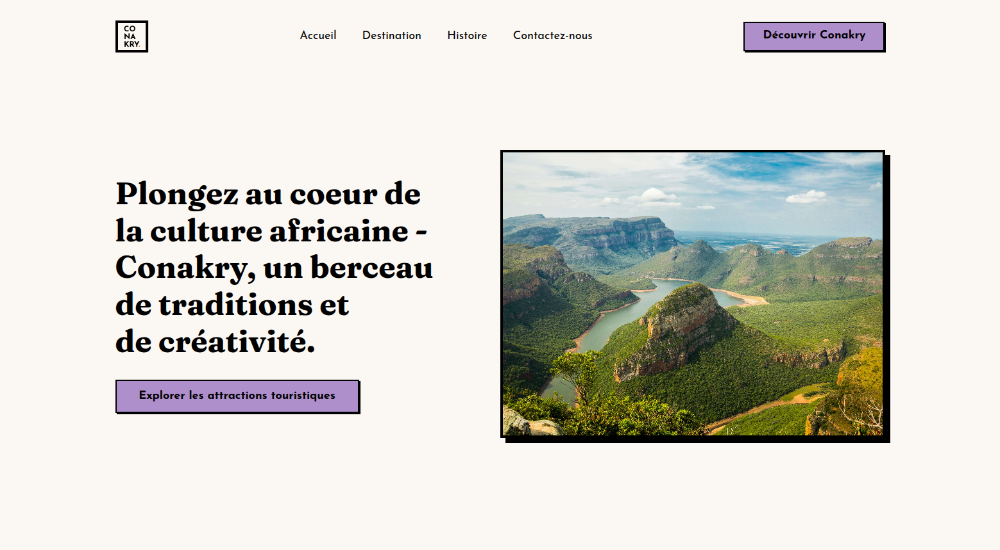
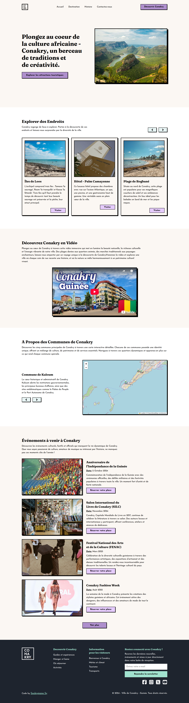
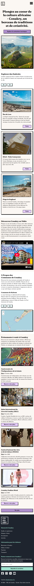
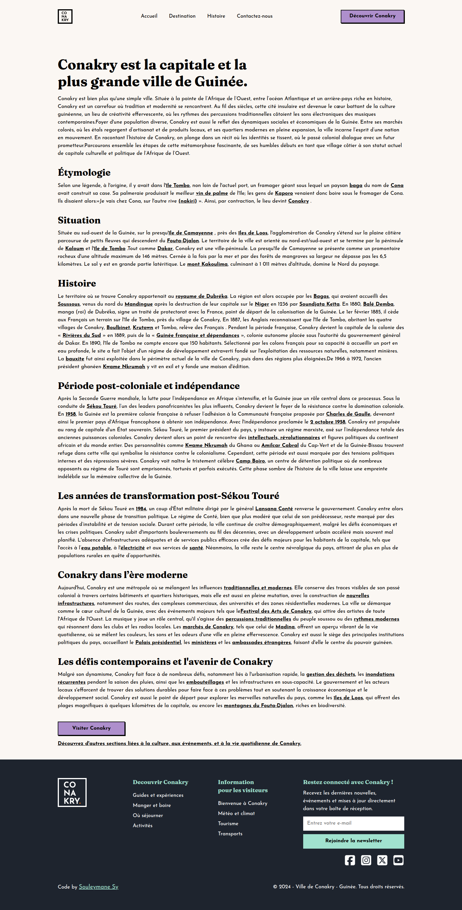
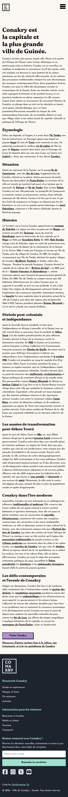
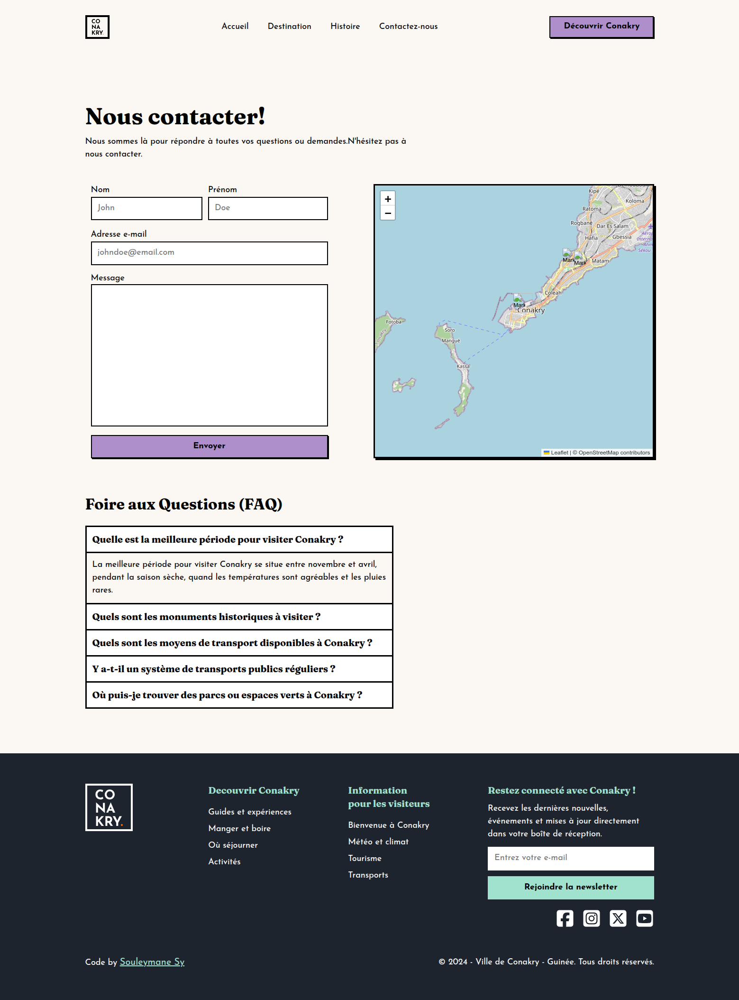
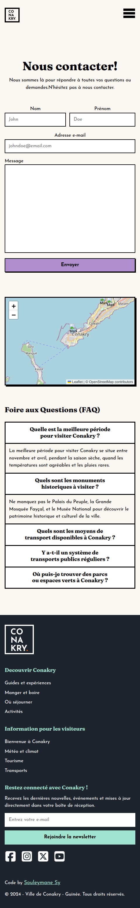

# Conakry - Perle de l'Afrique de l'Ouest



## 🏆 3ème Prix - Concours "Le Repaire du Web"

Ce projet a été réalisé dans le cadre du concours organisé par ["Le Repaire du Web"](https://discord.gg/9WryX5zs) (Discord animé par le youtubeur ["Enzo Ustariz"](https://www.youtube.com/@EcoleduWeb)), ayant pour thème la création d'un site web pour une ville. J'ai choisi de mettre en valeur Conakry, capitale de la Guinée et ma ville natale.

**Classement obtenu** : 🥉 3ème place parmi une douzaine participants.

## 🌐 Aperçu

"Conakry - Perle de l'Afrique de l'Ouest" est un site vitrine dédié à la découverte de la capitale guinéenne. Ce projet vise à promouvoir le tourisme et à présenter les richesses culturelles, historiques et naturelles de cette ville unique.

[Lien vers la démo](https://conakry-website-challenge-z4t7.vercel.app/) | [Présentation du projet](https://discord.com/channels/655077317911117860/1041772720066674760)

## ✨ Fonctionnalités

- **Découverte interactive** de la ville à travers différentes sections
- **Galerie photo** des sites touristiques emblématiques
- **Carte interactive** des points d'intérêt
- **Histoire de la ville** avec chronologie
- **Guide gastronomique** présentant les spécialités locales
- **Informations pratiques** pour les visiteurs
- **Design responsive** adapté à tous les appareils.

## 🛠️ Technologies utilisées

- **React 18** - Bibliothèque front-end.
- **TypeScript** - Pour un code typé et robuste.
- **Sass/SCSS** - Pour des styles modulaires et maintenables.
- **Vite** - Bundler rapide et efficace.
- **PNPM** - Gestionnaire de paquets performant.
- **React Router** - Navigation entre les pages.
- **React Player** - Une bibliothèque de composant React pour lire une variété d'URL, y compris les chemins d'accès aux fichiers et YouTube.
- **Leaflet** - Intégration de cartes interactives.

## 🚀 Installation et démarrage

```bash
# Cloner le dépôt
git clone https://github.com/SouleymaneSy7/conakry-website-challenge.git

# Se déplacer dans le dossier
cd conakry-website-challenge

# Installer les dépendances
pnpm install

# Lancer le serveur de développement
pnpm dev

# Construire pour la production
pnpm build
```

Le site sera accessible à l'adresse [http://localhost:3000](http://localhost:3000)

## 📁 Structure du projet

```
conakry-website-challenge/
│
├── public/
│   ├── favicon-32-32.png
├── src/
│   ├── assets/
│   │   ├── fonts
│   │   ├── images
│   │   ├── svgs
│   ├── components/
│   ├── constants/
│   ├── hooks/
│   ├── icons/
│   ├── pages/
│   ├── sass/
│   ├── App.tsx
│   ├── main.tsx
│   └── vite-env.d.ts
├── .gitignore
├── eslint.config.js
├── index.html
├── package.json
├── pnpm-lock.yaml
├── README.md
├── tsconfig.json
└── vite.config.ts
```

## 🌟 Fonctionnalités à venir

- [ ] Version multilingue (français, anglais)
- [ ] Mode sombre/clair
- [ ] Section événements culturels
- [ ] Intégration de témoignages de visiteurs
- [ ] Optimisation des performances

## 🔗 Liens utiles

- [Office du tourisme de Conakry](https://www.tourisme-guinee.gov.gn/)
- [Concours "Le Repaire du Web"](https://discord.gg/9WryX5zs)
- [Chaîne YouTube d'Enzo Ustariz](https://www.youtube.com/@EcoleduWeb)

## 📸 Captures d'écran

<details>
  <summary>Cliquez pour afficher les captures d'écran</summary>
    <div>
      <h2>Page d'accueil</h2>
      
      <h2>Page d'accueil - Mobile</h2>
      
      <h2>Histoire</h2>
      
      <h2>Histoire - Mobile</h2>
      
      <h2>Contactez-Nous</h2>
      
      <h2>Contactez-Nous - Mobile</h2>
      
    </div>
</details>

## 👏 Remerciements

- À Enzo Ustariz et toute la communauté du "Repaire du Web" pour l'organisation de ce concours enrichissant.
- Aux autres participants pour leur créativité et leurs retours constructifs.
- À tous ceux qui ont testé le site et fourni des retours précieux.

## Auteur

- GitHub - [Souleymane Sy](https://github.com/SouleymaneSy7)
- Frontend Mentor - [@SouleymaneSy7](https://www.frontendmentor.io/profile/SouleymaneSy7)
- Dev Challenges - [Souleymane Sy](https://devchallenges.io/profile/534cd213-3165-4c16-bdcf-058e1f468da0)
- Twitter - [@Souleymanesy43](https://twitter.com/Souleymanesy43)
